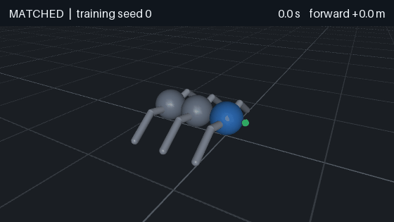
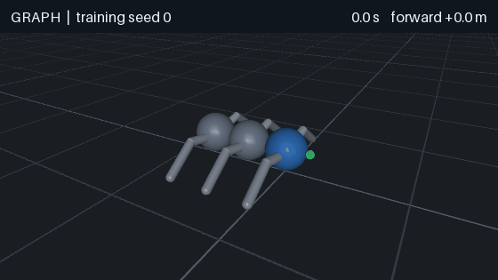
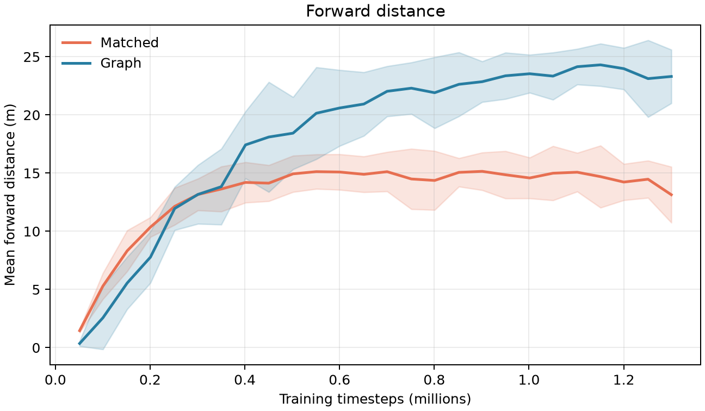
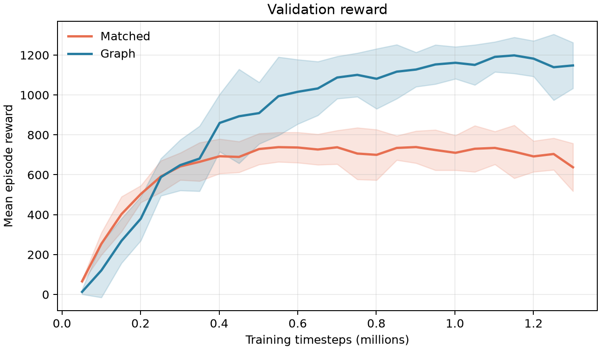

# NerveNet Reimplementation

An independent implementation of the graph policy in [*NerveNet: Learning Structured Policy with Graph Neural Networks*](https://www.cs.toronto.edu/~tingwuwang/nervenet.html), built with MuJoCo, PyTorch, Gymnasium, and Stable-Baselines3. The authors' code was not used.

We built a modular crawler, trained a graph policy and a similarly sized MLP on the same task, and evaluated both across five training seeds. With a training budget of up to 1.3 million environment steps, the graph policy traveled **24.59 ± 1.58 m** over a 10-second episode; the matched MLP traveled **16.04 ± 1.57 m**. These are descriptive results for our crawler, not a reproduction of the paper's transfer experiments.

| Matched MLP | Graph policy |
|:---:|:---:|
|  |  |

*Actual MuJoCo rollouts from validation-selected checkpoints. Both clips use training seed 0, held-out episode seed 30,000, and the same 10-second duration. The camera follows the crawler; the grid and distance label reveal its motion. One episode is illustrative; the numbers below aggregate 250 test episodes per policy.*

## What we built

The crawler has three connected torso modules, six two-segment legs, 12 motorized hip/knee joints, and two passive spine hinges. The same [MuJoCo model builder](nervenet/models/crawler.py) can create other module counts. Each body becomes a graph node, and physical parent-child connections become bidirectional message routes.

Each body reports a small set of numbers. The root torso reports its height, orientation, and velocity; a leg segment reports its joint angle and speed. Every body also reports forces acting on it. For this crawler, both policies receive the same 15 rows of 17 numbers.

The graph policy uses those numbers in four steps:

1. Each body turns its own numbers into a short internal summary.
2. Connected bodies exchange summaries with their neighbors.
3. Each body updates its summary using what it heard. The exchange and update repeat four times, so information can travel beyond immediate neighbors.
4. The bodies with motors use their final summaries to choose motor commands.

The MLP receives the same numbers as one long list, without the body connections. Both policies use the same value estimator and PPO training setup. Their action networks have nearly the same number of adjustable weights (within 0.3%). [The exact architecture and parameter counts are in the technical notes.](docs/crawler-design.md)

Every 0.02 seconds, the crawler earns a reward for forward speed and pays a small cost for large motor commands. An episode lasts 10 simulated seconds (500 such steps). Neither policy receives a walking demonstration or a straightness reward.

## Experiment and results

We trained five seeds per policy (`0`–`4`). Each run saved a checkpoint about every 50,000 environment steps. We chose each run's best checkpoint using ten fixed validation episodes, then evaluated it on 50 separate held-out episodes. The table shows the **1.3M-step budget**, with mean ± standard deviation across the five training seeds. Selected checkpoints can occur before 1.3M steps.

| Metric | Matched MLP | Graph policy |
|---|---:|---:|
| Forward distance | 16.04 ± 1.57 m | **24.59 ± 1.58 m** |
| Episode reward | 783.15 ± 77.35 | **1213.79 ± 78.31** |
| Absolute lateral distance | 3.09 ± 1.12 m | 1.96 ± 1.17 m |
| Actions near saturation | 65.1% ± 6.2% | 49.4% ± 4.6% |
| Actuated joint speed | 8.55 ± 0.62 rad/s | 8.54 ± 0.21 rad/s |





The graph policy traveled **53.3% farther** on average in this held-out evaluation. It was also much slower to train on this machine: median recorded wall-clock time per seed was **83.3 minutes** for the graph policy and **8.6 minutes** for the MLP. Training times are machine-specific; one graph run included a long pause during system sleep, so we report medians. Shaded plot regions are standard deviations across seeds, not confidence intervals.

This experiment supports a limited conclusion: graph structure helped this implementation learn locomotion on this one custom crawler and training setup. It does **not** establish that graph policies generally outperform MLPs, nor does it test the paper's main size- or disability-transfer claims. Both policies still use fast joint motion and many large motor commands, so distance alone is not a measure of a natural gait.

The [full results package](results/crawler-1m-v1/README.md) contains the 1M and 1.3M reports, per-run CSV data, per-episode JSON evaluations, learning curves, and recorded training sessions. Model checkpoints and verbose logs are excluded from Git because of their size.

## Run it locally

The project was developed and tested with Python 3.14 and MuJoCo 3.14 on macOS. From the repository root:

```bash
python3.14 -m venv .venv
source .venv/bin/activate
python -m pip install -r requirements.txt
python -m unittest discover -s tests -v
```

Preview the untrained crawler and its joints:

```bash
mjpython -m nervenet.cli.view_crawler --modules 3 --motion gait
```

On macOS, MuJoCo's interactive viewer and offscreen GIF renderer require `mjpython`. Training and evaluation use regular `python`.

To reproduce the full comparison, expect substantial compute time for the graph runs:

```bash
python -m nervenet.cli.comparison create --name crawler-1m-v1
python -m nervenet.cli.comparison run --name crawler-1m-v1
python -m nervenet.cli.comparison report --name crawler-1m-v1
python -m nervenet.cli.comparison extend --name crawler-1m-v1 --timesteps 300000
python -m nervenet.cli.comparison report --name crawler-1m-v1
python -m nervenet.cli.comparison export --name crawler-1m-v1
```

`run` can resume interrupted work from completed checkpoints. The extension continues the original runs to a 1.3M-step target and uses a fresh held-out test seed range. Once checkpoints exist, regenerate the clips with:

```bash
mjpython -m nervenet.cli.render_comparison_gif --policy-type matched
mjpython -m nervenet.cli.render_comparison_gif --policy-type graph
```

For one-off training, checkpoint viewing, and the experiment file layout, see [managed experiments](docs/experiments.md). The [comparison protocol](docs/comparisons.md) describes seed separation, checkpoint selection, reports, and export in detail.

## Repository map

| Path | Purpose |
|---|---|
| [`nervenet/models/`](nervenet/models/) | Modular MuJoCo crawler builder |
| [`nervenet/envs/`](nervenet/envs/) | Gymnasium physics task and graph observation wrapper |
| [`nervenet/graphs/`](nervenet/graphs/) | Body graph, routes, and node observations |
| [`nervenet/policies/`](nervenet/policies/) | Graph actor, matched MLP, critic, and PPO adapters |
| [`nervenet/comparisons/`](nervenet/comparisons/) | Multi-seed experiment orchestration and reporting |
| [`results/crawler-1m-v1/`](results/crawler-1m-v1/) | Lightweight, versioned study results |
| [`tests/`](tests/) | Model, environment, policy, and experiment tests |

The original [NerveNet paper and project page](https://www.cs.toronto.edu/~tingwuwang/nervenet.html) are the scientific reference. This repository is an independent learning project with a distinct robot and evaluation protocol.
