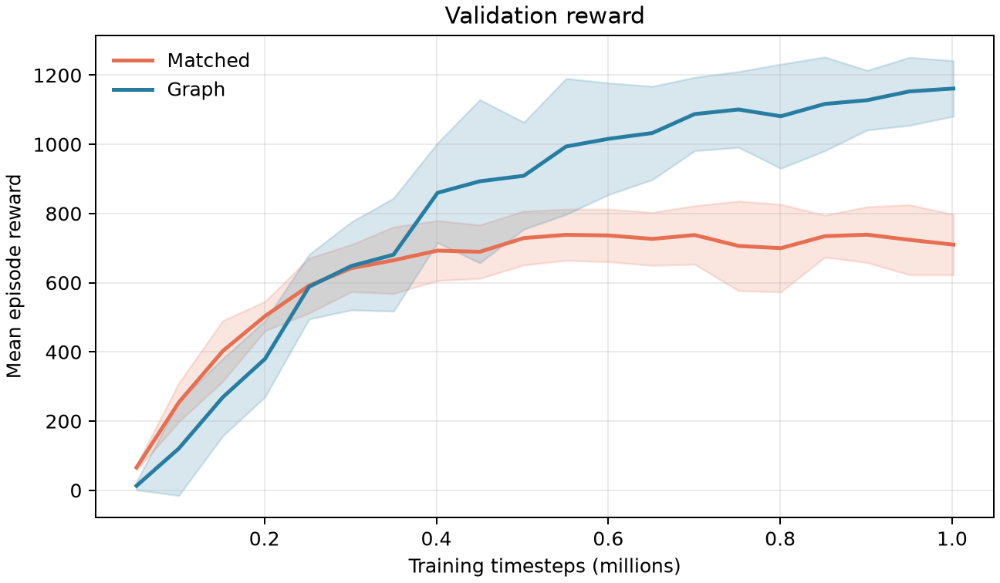
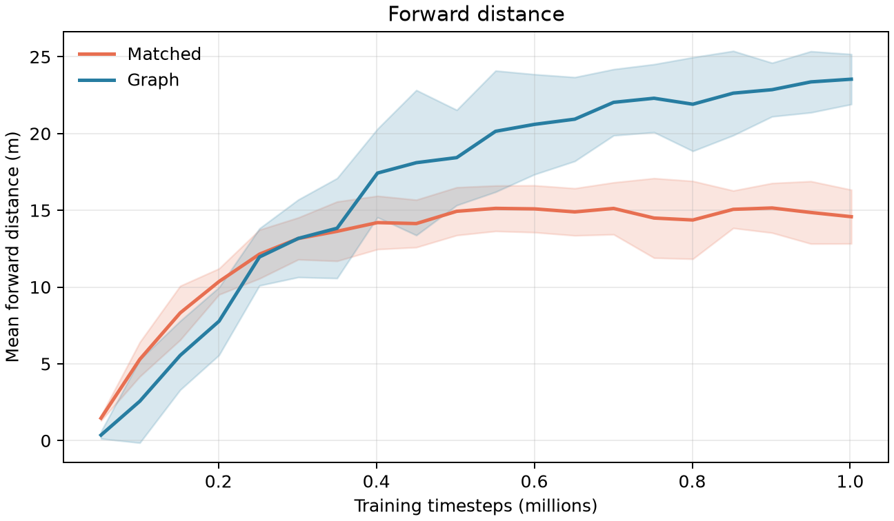

# crawler-1m-v1

## Experiment

Matched MLP and graph PPO policies were trained for 1,000,000 timesteps on a 3-module crawler. Results use 5 independent training seeds.

Checkpoints were validated every 50,000 timesteps on 10 fixed episodes. The best checkpoint per run was selected by validation reward, then evaluated on 50 held-out episodes.

## Learning curves

## Held-out results

Values are mean ± standard deviation across training seeds.

| Policy | Reward | Forward distance | Absolute lateral distance | Action saturation | Joint speed |
|---|---:|---:|---:|---:|---:|
| Matched | 760.84 ± 91.13 | 15.58 ± 1.83 m | 2.60 ± 0.15 m | 62.2% ± 2.4% | 8.32 ± 0.29 rad/s |
| Graph | 1160.12 ± 88.65 | 23.50 ± 1.79 m | 2.43 ± 1.28 m | 46.0% ± 7.2% | 8.23 ± 0.56 rad/s |

## Selected checkpoints

| Policy | Training seed | Timestep | Validation reward |
|---|---:|---:|---:|
| Matched | 0 | 550,912 | 736.76 |
| Matched | 1 | 751,616 | 885.31 |
| Matched | 2 | 901,120 | 799.17 |
| Matched | 3 | 651,264 | 706.85 |
| Matched | 4 | 901,120 | 738.34 |
| Graph | 0 | 1,001,472 | 1150.35 |
| Graph | 1 | 950,272 | 1258.44 |
| Graph | 2 | 851,968 | 1259.22 |
| Graph | 3 | 1,001,472 | 1040.00 |
| Graph | 4 | 700,416 | 1166.56 |

## Interpretation

This report records descriptive results for this controlled comparison. Conclusions should be limited to the tested crawler, reward, optimizer configuration, and training budget.

Raw per-run results are in `results.csv`; aggregated values and the complete configuration are in `summary.json`.
